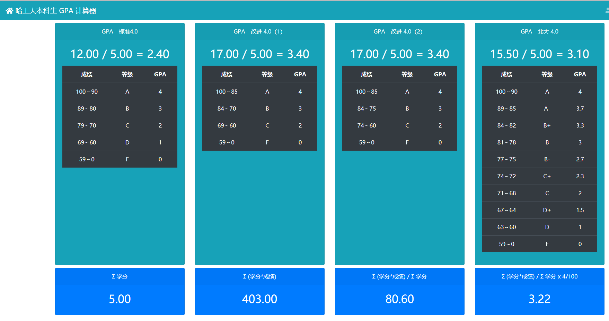
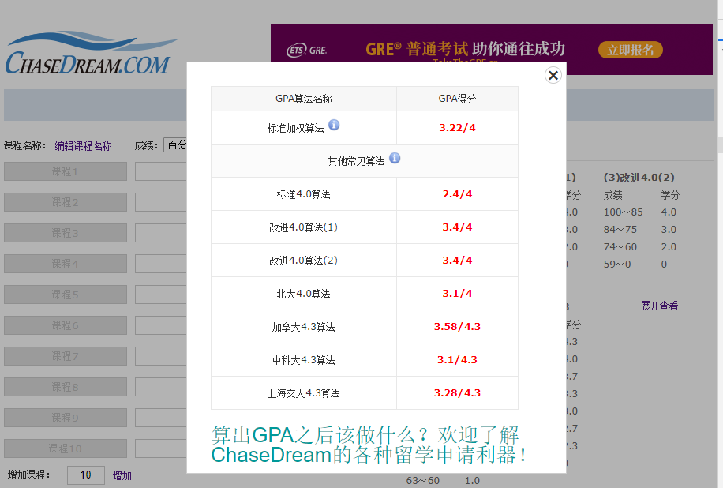

# hit-gpa

> 哈工大本科生 GPA 计算器。使用统一身份一键登录，即可计算自己的 GPA 信息。

应用网址：https://hit-gpa.upupming.site

:warning: 拉取成绩数据可能需要半分钟到一分钟的时间，请耐心等待。

测试结果：

| [hit-gpa](https://hit-gpa.upupming.site)     | [chasedream GPA 计算器](https://apps.chasedream.com/gpa/#) |
| -------------------------------------------- | ---------------------------------------------------------- |
|  |             |

## Feature

- 哈工大统一身份认证登录
- 记住账号、密码
- 多种 GPA 算法
- 成绩导出成 Excel 表格

## 本地运行

```bash
yarn
# Koa 开发模式
yarn start:dev
# Vue 开发模式
yarn serve
```

打开 http://localhost:8080/

## 项目部署

在服务器中运行 `Nightware` 所依赖的 `Electron` 无头浏览器需要安装 X virtual frame buffer：

```bash
# https://stackoverflow.com/a/9210912/8242705
sudo apt-get install xvfb imagemagick
# https://blog.csdn.net/HelloZEX/article/details/80762705
sudo apt-get install google-chrome
```

安装完毕之后，执行：

```bash
# 构建 Vue
yarn build
# 开启 Koa
xvfb-run --server-args='-screen 0, 1024x768x24' yarn start:dev
```

## 开发资源

本项目将原来的 [jwes](http://jwes.hit.edu.cn) 数据整理成 API 形式：

POST `/api/grade`

```json
{
  "username": "1160300625",
  "password": "**********"
}
```

将会得到如下格式的信息：

```json
{
  "labels": [...
  ],
  "gradeForAllCourses": [...
  ],
  "noGradeCourses": [...
  ]
}
```

## 致谢

### GPA 计算器

1. https://github.com/sndnyang/superbGPACalculator
2. https://apps.chasedream.com/gpa

### 参考项目

1. Vue & Koa: https://github.com/Molunerfinn/node-github-profile-summary
2. Nightmare: https://github.com/segmentio/nightmare
3. Cheerio: https://github.com/cheeriojs/cheerio

### 参考文章

1. https://juejin.im/post/5b4f007fe51d4519277b9707
2. https://medium.com/of-all-things-tech-progress/introduction-to-webcrawling-with-javascript-and-node-js-f5a3798ee8ac
3. https://stackoverflow.com/questions/9210765/any-way-to-start-google-chrome-in-headless-mode
